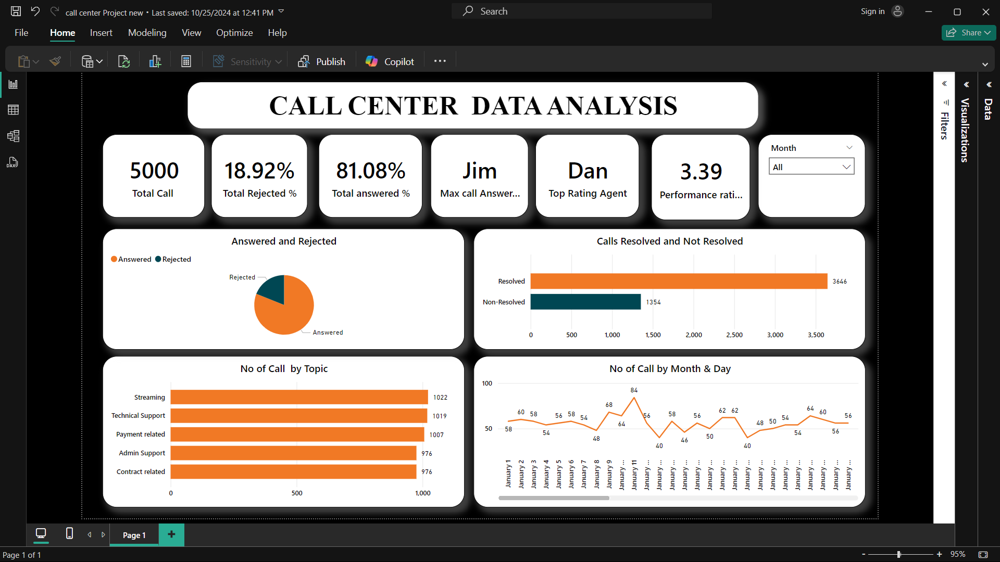

# 📞 Call Center Data Analysis Dashboard

This dashboard visualizes call center performance metrics to help assess service efficiency and agent productivity.

## 🔍 Key Insights

- ☎️ **Total Calls**: 5000
- ❌ **Rejected Calls**: 18.92%
- ✅ **Answered Calls**: 81.08%
- 🧑‍💼 **Most Calls Answered By**: Jim
- ⭐ **Top Performing Agent**: Dan
- 📈 **Performance Rating**: 3.39

## 📊 Breakdown:

- 📎 **Answered vs Rejected** (Pie Chart)
- ✅ **Resolved vs Not Resolved**: 3646 vs 1354
- 🗂️ **Topics**: Streaming, Tech Support, Payment, Admin, Contract
- 📆 **Daily Call Volume** (Line Chart)

## 🛠 Tools Used

- Power BI
- Likely input from Excel/CSV sources

## 📸 Screenshot

> Don’t forget to update the image path after uploading to GitHub.

## 📬 Feedback

For suggestions or questions, open a GitHub issue or connect with the project maintainer.
